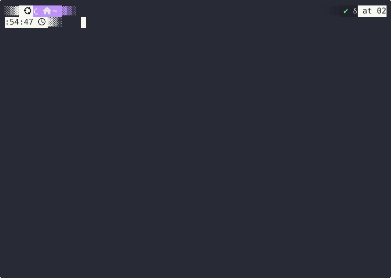

<p align="center">
  <picture>
    <source media="(prefers-color-scheme: dark)" srcset="docs/_static/neuroai_anim_dark.gif">
    <source media="(prefers-color-scheme: light)" srcset="docs/_static/neuroai_anim_light.gif">
    
  </picture>
</p>

<h3 align="center">The Python suite for brain-AI research</h3>
<p align="center"><sub>Simple &nbsp;·&nbsp; Fast &nbsp;·&nbsp; Robust &nbsp;·&nbsp; Scalable</sub></p>

<p align="center">
  <a href="https://github.com/facebookresearch/neuroai/actions/workflows/ci.yml"></a>
  <a href="https://facebookresearch.github.io/neuroai/"></a>
  <a href="https://github.com/facebookresearch/neuroai/blob/main/LICENSE"></a>
  <a href="https://www.python.org/"></a>
  <a href="https://pytorch.org/"></a>
</p>

<p align="center">
  <a href="#install">Install</a> &nbsp;·&nbsp;
  <a href="#packages">Packages</a> &nbsp;·&nbsp;
  <a href="#development">Development</a> &nbsp;·&nbsp;
  <a href="#contributing">Contributing</a>
</p>

---

neuroai is a modular Python suite for brain-AI research. It covers the full pipeline: accessing curated public brain datasets, building typed & cacheable feature pipelines across all recording modalities (MEG, EEG, fMRI, iEEG, EMG) and stimulus types (text, images, audio, video), and training deep-learning models — with a single unified interface.

<br>

<p align="center">
  <a href="https://facebookresearch.github.io/neuroai/">
    
  </a>
</p>
<p align="center">
  <sub>Interactive quickstarts &nbsp;·&nbsp; Step-by-step tutorials &nbsp;·&nbsp; Complete API reference<br>
  Pick a task, a modality, a dataset — the docs generate the code for you.</sub>
</p>

<br>

<p align="center">
  
</p>

---

## Install

<table align="center" width="80%"><tr><td align="center">

```bash
pip install neuralset neuralfetch neuraltrain
```

<sub>Python 3.10+ &nbsp;·&nbsp; requires PyTorch 2.0+</sub>

</td></tr></table>

---

## Packages

Each pipeline step maps to a dedicated package:

<table width="100%">
<tr>
<td align="center" valign="top" width="33%">
<br>
<picture>
  <source media="(prefers-color-scheme: dark)" srcset="docs/_static/neuralfetch_dark.png">
  
</picture>
<br><br>
<strong><a href="https://facebookresearch.github.io/neuroai/neuralfetch/index.html">neuralfetch</a></strong><br><br>
<sub>Access the world's curated brain datasets.<br>
19+ studies from OpenNeuro, DANDI, OSF,<br>
HuggingFace, Zenodo and more.</sub>
<br><br>

```bash
pip install neuralfetch
```

<br>
</td>
<td align="center" valign="top" width="33%">
<br>
<picture>
  <source media="(prefers-color-scheme: dark)" srcset="docs/_static/neuralset_dark.png">
  
</picture>
<br><br>
<strong><a href="https://facebookresearch.github.io/neuroai/neuralset/index.html">neuralset</a></strong><br><br>
<sub>Turn brain data into AI-ready features.<br>
Events, extractors, transforms &amp;<br>
segmentation into PyTorch datasets.</sub>
<br><br>

```bash
pip install neuralset
```

<br>
</td>
<td align="center" valign="top" width="33%">
<br>
<picture>
  <source media="(prefers-color-scheme: dark)" srcset="docs/_static/neuraltrain_dark.png">
  
</picture>
<br><br>
<strong><a href="https://facebookresearch.github.io/neuroai/neuraltrain/index.html">neuraltrain</a></strong><br><br>
<sub>Deep learning for the brain, supercharged.<br>
ConvNets, Transformers, losses, metrics<br>
&amp; multi-GPU training (PyTorch + Lightning).</sub>
<br><br>

```bash
pip install neuraltrain
```

<br>
</td>
</tr>
</table>

---

## Project structure

```
neuroai/
├── neuralset-repo/       # Core pipeline: events, extractors, transforms
├── neuralfetch-repo/     # Dataset catalog and download
├── neuraltrain-repo/     # Models, training loops, metrics
└── docs/                 # Sphinx documentation
```

---

## Development

```bash
git clone https://github.com/facebookresearch/neuroai.git
cd neuroai

# Create a venv (uv recommended)
uv venv .venv && source .venv/bin/activate
uv pip install pip                             # needed for spacy model downloads

# Install all packages in editable mode
uv pip install -e 'neuralset-repo/.[dev,all]'
uv pip install -e 'neuralfetch-repo/.'
uv pip install -e 'neuraltrain-repo/.[dev,all]'

# Verify
pre-commit install
pytest neuralset-repo/neuralset -x
```

---

## Contributing

Contributions are welcome — see [CONTRIBUTING.md](CONTRIBUTING.md) for details.

```bash
ruff check .          # lint
ruff format .         # format
mypy neuralset-repo/  # type check
pytest -x             # test
```

---

## Related projects

- **[exca](https://facebookresearch.github.io/exca/)** — Execution & caching framework powering neuroai's compute graph
- **[MNE-Python](https://mne.tools/)** — Electrophysiology analysis (used internally for MEG/EEG I/O)

---

<details>
<summary><b>Code demo</b></summary>
<p align="center">
  
</p>
</details>

---

## License

This project is licensed under the [MIT License](LICENSE).

<sub>References to third-party content are subject to their own licenses.</sub>

---

<p align="center">
  <sub>Built with ❤️ at <a href="https://ai.meta.com/">Meta AI</a></sub>
</p>
